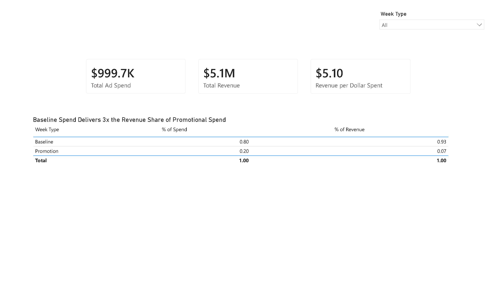
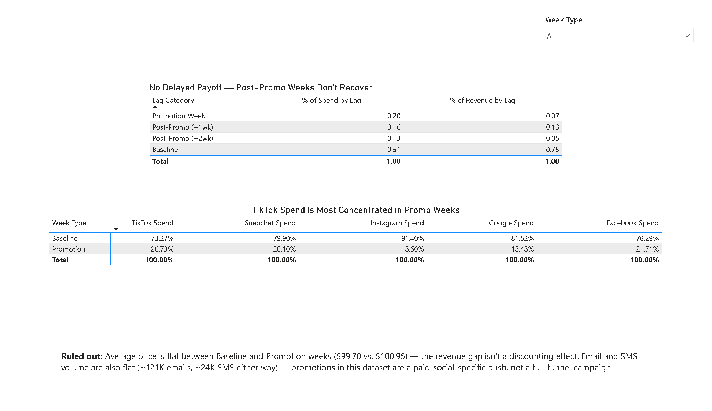

# Is Promotional Ad Spend Actually Working? A Baseline-vs-Promotion Analysis

**Tools Used:** Power Query (M) | Power BI | DAX
**Data:** Weekly marketing spend dataset — 104 weeks (Sept 2023–Sept 2025), spend across Facebook, Google, TikTok, Instagram, and Snapchat, plus a promotions flag, pricing, email/SMS volume, and revenue
**Links:** [Download the .pbix file](mmm-baseline-vs-promotion.pbix) · [Dashboard PDF export](mmm-baseline-vs-promotion.pdf) · [Full repo](https://github.com/blordeus/mmm-baseline-vs-promotion)

## The Question That Changed

This project didn't start with the question it ended with, and that's worth being upfront about.

The original brief was a standard media-mix framing: *"which channels have hit diminishing returns, so budget can be reallocated between them?"* That assumes a smooth, predictable relationship between spend and revenue. The data didn't support that assumption. Revenue across the 104 weeks was sharply bimodal — 53 weeks brought in under $1,000, while 18 weeks brought in over $100,000 — despite Facebook spend running in literally every single week of the dataset. Steady spend, spiky revenue. That pattern made the original diminishing-returns question the wrong one to ask.

The real question became: **is steady weekly spend actually earning its keep, or is revenue almost entirely driven by promotional weeks — meaning the spend that runs during "normal" weeks might be wasted?**

## Data Pipeline & Modeling

Cleaned and modeled entirely in **Power Query (M)** and **Power BI/DAX** — no SQL, consistent with the toolchain decision made for this stage of the portfolio.

**Key steps:**
- Typed `week` as Date, all spend/revenue columns as Decimal Number
- Added a `Week Type` column (`Promotion` / `Baseline`) derived from the raw `promotions` flag — this became the primary grouping field for every visual
- Built a `Total Spend` column summing all five channel columns, using `Number.From()` on each value to force numeric conversion regardless of the column's prior type — this fixed a real DAX error (`SUM cannot work with values of type String`) encountered mid-build, caused by a text-typed spend column
- To test whether promotions have a *delayed* effect on revenue, built a self-referencing lookup: an `Index` column, a duplicated (not referenced — a live reference creates a circular dependency Power BI silently rejects) `MMM_Lookup` query, and two merges matching each week against the promotion status 1 and 2 weeks prior
- Derived a `Lag Category` field (`Promotion Week`, `Post-Promo (+1wk)`, `Post-Promo (+2wk)`, `Baseline`) from that lookup

**Core DAX measures:**
```DAX
Total Ad Spend = SUM(MMM[Total Spend])
Total Revenue = SUM(MMM[revenue])
Revenue per Dollar Spent = DIVIDE([Total Revenue], [Total Ad Spend], 0)

% of Spend = DIVIDE([Total Ad Spend], CALCULATE([Total Ad Spend], ALL(MMM)), 0)
% of Revenue = DIVIDE([Total Revenue], CALCULATE([Total Revenue], ALL(MMM)), 0)
```
*(Note: `ALL(MMM)` — clearing the whole table — was required here instead of `ALL(MMM[column])`. Column-level `ALL()` silently failed to clear filter context in this model, likely due to the two active relationships to `MMM_Lookup` created for the lag check. Worth knowing if reusing this pattern elsewhere.)*

## Dashboard Preview

**Executive Summary** — KPI cards (Total Ad Spend, Total Revenue, Revenue per Dollar Spent) and the primary finding, titled *"Baseline Spend Delivers 3x the Revenue Share of Promotional Spend."*

**Deep Dive** — the lag-category table (testing for delayed promotional lift), a per-channel spend-concentration matrix, and a plain-text callout on two ruled-out alternative explanations.





## Key Insights

1. **Baseline weeks — not promotional weeks — drive revenue.** Baseline weeks account for 80% of total spend and 93% of total revenue. Promotional weeks account for 20% of spend but only 7% of revenue. That's roughly a **3.3x efficiency gap** between the two.

2. **There's no evidence of a delayed promotional payoff.** Before accepting "promotions underperform" as the finding, the data was tested for a lag effect — maybe a promotion's revenue shows up a week or two later, not the same week. It doesn't: Post-Promo (+1wk) weeks capture 16% of spend and 13% of revenue; Post-Promo (+2wk) weeks capture 13% of spend and just 5% of revenue. If anything, the gap widens the further out you look, not narrows.

3. **The inefficiency is concentrated in one channel.** TikTok spend is the most promo-weighted of the five channels — 26.7% of all TikTok spend happens during promotional weeks, more than double Instagram's 8.6%. TikTok is the channel most exposed to the pattern described above.

4. **Two plausible alternative explanations were checked and ruled out.** Average price is flat between Baseline and Promotion weeks ($99.70 vs. $100.95) — the revenue gap isn't a discounting effect where promos sell more units at a lower margin. Email and SMS send volume are also flat regardless of week type (~121K emails, ~24K SMS either way) — promotions in this dataset are a paid-social-specific push, not a full-funnel campaign that also ramps email and SMS.

## Strategic Recommendations

- **Reduce promotional-week spend, particularly on TikTok**, and reallocate it toward maintaining or extending baseline-level spend, which is demonstrably more efficient in this data.
- **Investigate what's actually driving baseline-week revenue** before assuming it's the ad spend itself — organic demand, repeat customers, or seasonality could be doing more work than the media mix. This dataset alone can't separate that out.
- **If promotions are kept for reasons beyond this revenue metric** (inventory clearance, customer acquisition, brand awareness), track those goals explicitly — this analysis only speaks to same-window revenue return, not the full set of reasons a business might run a promotion.

## Limitations & Data Quality Notes

- **Revenue attribution is at the week level only**, not tied to individual channels — the per-channel findings describe spend concentration, not per-channel revenue, since the dataset has one combined revenue column.
- **104 weeks is a modest sample**, and only 22 of them are promotional — the per-channel promo-share percentages are directionally solid but come from a relatively small slice of the data.
- **This analysis can't separate correlation from causation.** It's possible some third factor (seasonality, external demand shifts) drives both when promotions run and when baseline revenue spikes. A true causal claim would need a controlled test, not observational weekly data.

## What I'd Do With More Data

A stronger version of this analysis would include per-channel revenue attribution (not just per-channel spend), a longer time window to increase the promotional-week sample size, and ideally a controlled holdout test — running baseline spend with no promotions in some markets and comparing directly — to move from correlation toward a causal read.
